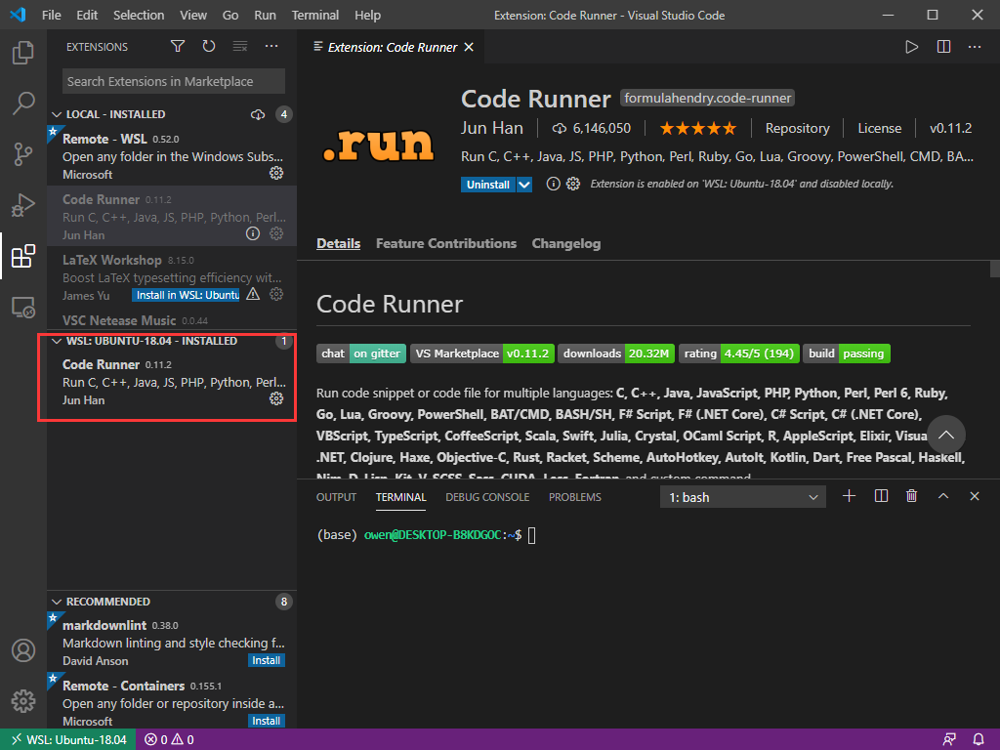
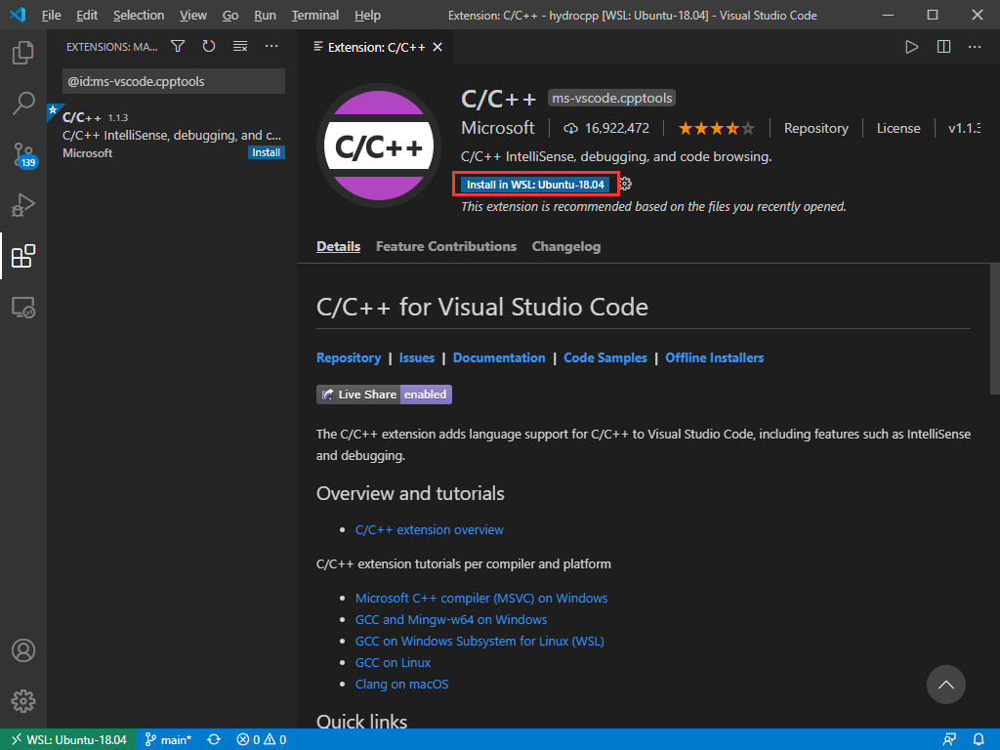
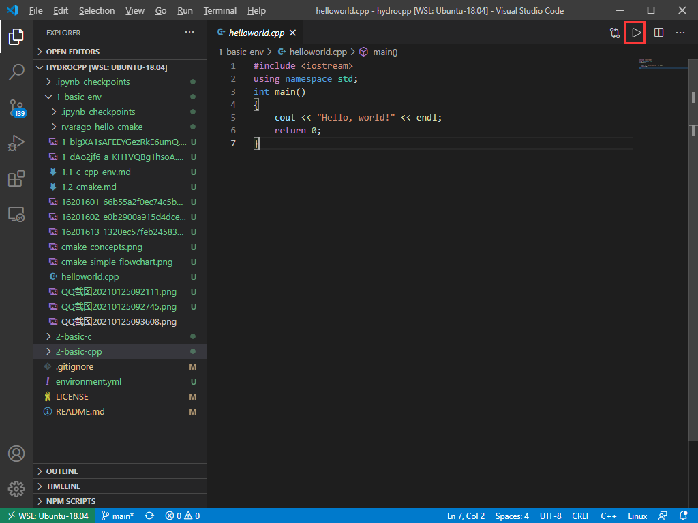

# C/C++环境配置

本文主要参考以下资料：

- [在VSCode搭建C/C++环境](https://www.bilibili.com/video/BV1nt4y1r7Ez)
- [Win10+WSL+VS Code搭建Ubuntu开发环境](https://zhuanlan.zhihu.com/p/57882542)
- [C++ 生态：编译器、IDE、测试工具大全](https://cloud.tencent.com/developer/news/453402)
- [使用 VSCode 打造一站式全平台开发体验](https://zhuanlan.zhihu.com/p/120360684)
- [C++环境设置](https://www.runoob.com/cplusplus/cpp-environment-setup.html)

## 编译器

源码需要"编译"，转为机器语言，这样 CPU 才可以按给定指令执行程序。C 语言编译器用于把源代码编译成最终的可执行程序。最常用的免费可用的编译器是 GNU 的 C/C++ 编译器。

一般linux系统上都已经安装过C编译器了，win10下的ubuntu也是默认安装了的，可能需要补充 g++等的安装（安装语句：sudo apt install g++），视后面情况而定。

这里补充介绍下windows下的安装。

使用和linux下相似的编译器GCC，在windows下GCC的一个常用移植版是MinGW。

为了安装 MinGW，请访问 [MinGW 的主页](www.mingw.org)，进入 MinGW [安装教程页面](http://www.mingw.org/wiki/InstallationHOWTOforMinGW)，按提示下载 MinGW 安装程序。几点需要注意的地方：

- 安装路径上不要有空格，个人认为最好也不要有中文
- 官方不建议手动配置安装选项，所以直接按照默认配置安装即可
- 安装最后的时候有PATH配置需要注意

总之按照官方提供的mingw-get-setup exe安装工具一路默认即可。安装后会进入包管理页面。

当安装 MinWG 时，至少要安装 gcc-core、gcc-g++、binutils 和 MinGW runtime，但是一般情况下都会安装更多其他的项。对于初次安装，选择Basic setup选项并勾选右侧各项进行安装是一个不错的选择。

然后点击左上角的installation选项，选择apply changes，然后点击弹出框的apply。等待安装即可。

根据官方文档要求，安装完毕之后检查下MSYS的配置。需要确保MSYS知道MinGW安装在哪里。这部分按照官方文档做即可，一般应该是不用做什么的，检查一遍即可。

添加安装的 MinGW 的 bin 子目录到 PATH 环境变量中，这样就可以在命令行中通过简单的名称来指定这些工具。如果没有权限，则在用户设置页面（windows搜索框搜索account）下搜索environment即可。然后将MinGW文件夹下的bin文件夹加入到PATH变量中。另外还可以把MSYS文件夹下的bin也加入到环境变量中。

当完成安装时，可以从 Windows 命令行上运行 gcc、g++、ar、ranlib、dlltool 和其他一些 GNU 工具。例如：

``` code
gcc --version
```

程序 g++ 是**将 gcc 默认语言设为 C++ 的一个特殊的版本**，链接时它**自动使用 C++ 标准库**而不用 C 标准库。

g++ 在win10的ubuntu系统里不是默认安装的，所以用它之前执行下面的语句安装下：

```Shell
sudo apt install g++
```

举个例子：main.cpp

用g++编译：

```code
g++ helloworld.cpp
```

可以看到，由于命令行中未指定可执行程序的文件名，编译器采用默认的 a.out。程序可以如下方式在命令行运行：

```code
./a.out
```

通常我们使用 -o 选项指定可执行程序的文件名，以下实例生成一个 helloworld 的可执行文件：

```code
g++ helloworld.cpp -o helloworld
```

```code
./helloworld
```

通过遵循源码的命名规范并指定对应库的名字，用 gcc 来编译链接 C++ 程序是可行的。

```code
gcc helloworld.cpp -lstdc++ -o helloworldc
```

```code
./helloworldc
```

当有多个C++文件时，如 runoob1.cpp、runoob2.cpp，编译命令如下所示：

```code
g++ runoob1.cpp runoob2.cpp -o runoob
```

生成一个 runoob 可执行文件。

g++ 有些系统默认是使用 C++98，我们可以指定使用 C++11 来编译 main.cpp 文件：

```code
g++ -g -Wall -std=c++11 main.cpp
```

## 文本编辑器

文本编辑器选择vscode或者vs或者jetbrain旗下的CLion均可。当然牛逼的选手可以选择使用 Windows Notepad、OS Edit command、Brief、Epsilon、EMACS 和 vim/vi等。

这里我们以vscode为主。首先去官网下载并安装 vscode，安装一路默认即可。

然后因为我配置了win10下的ubuntu，所以vscode会自动提醒我安装 Remote-WSL 插件，安装即可，这样就能运行 win10下ubuntu文件系统里的代码了。

想进入 win10下的Ubuntu，点击左边栏的远程连接即可：


这时候可以看到打开一个新界面，左下角显示连接到Ubuntu了。尝试打开终端，可以看到默认的终端是bash了(没有连到WSL时候，默认终端是powershell)。

接下来安装 code runner 拓展。在 entensions 栏里搜索： code runner，然后选中点击“Install in WSL:Ubuntu-18.04”安装即可。可以看到在插件栏里，有如下情形（即WSL:UBUNTU-18.04的已安装插件里有 Code Runner）：



为了更方便运行C/C++的代码，再安装一个C/C++的扩展：



接下来尝试运行下code。打开当前项目：点击“File”->"Open Folder"，可以发现文件路径已经是linux的模式，找到本repo在自己电脑上的位置（输入“/mnt/c”即可进入C盘），点击“ok”即可打开。

进入本文件夹，打开 helloworld.cpp 的测试代码，点击右上角的运行，看看会有什么结果：



其他常用的插件：

- Visual Studio IntelliCode

## C++版的Jupyter

C++现在也有交互计算的环境了。C++版的jupyter kernel--*xeus*。参考[on Interactive Workflows for C++ with Jupyter](https://blog.jupyter.org/interactive-workflows-for-c-with-jupyter-fe9b54227d92)

Xeus是一个Jupyter kernel协议的C++实现。它本身不是一个kernel，而是一个能实现kernel功能的库。

Interpreted C++是在ROOT数据分析环境下的用Cling C++ interpreter的一个CERN的实现。

如何安装呢？这部分参考[jupyter notebook 安装 C/C++ kernel](https://juejin.im/post/5d71f461f265da03b1206f02)

利用xeus，可以在jupyterlab中开发不同语言的 jupyter kernel protocol，其中C++的版本是xeus-cling，可以参考：[xeus-cling](https://github.com/jupyter-xeus/xeus-cling)。注意如果需要运行本repo的C++代码，则必须要在linux或者mac环境下执行,并且不可以使用anaconda默认的conda环境，因为根据xeus-cling GitHub repo的readme文件所示，目前还不支持windows环境,还有anaconda下xeus-cling 会有冲突导致安装失败，所以必须使用miniconda，并注意将自己的环境变量配置到miniconda下。

前面的基础环境安装具体方式可以参考：[OuyangWenyu/elks](https://github.com/OuyangWenyu/elks)，在本文件夹下，win10下打开终端，进入bash，执行以下语句即可安装成功:

```Shell
conda env create -f environment.yml
```

C语言和C++由不同kernel支持，两者没有依赖关系，因此可以根据需要只安装其中一个，或两个都安装，但推荐**安装C++ kernel**，这是主流的kernel，由更加专业的团队维护的项目，C kernel是由个人开发者维护的小型项目，实现较为简单，但如果想快速体验在jupyter notebook运行C，也是不错的选择。

其他一些jupyter下C++相关的包如下，用到的话可以安装使用：

- Xwidgets：Jupyter生态的另一个重要特性就是Jupyter Interactive Widgets，方便构建可视化。参考[xwidgets](https://github.com/QUantStack/xwidgets)，按照提示安装即可，不再赘述。注意使用的时候需要C++ 14。
- xplot：xplot是一个C++为后端的二维绘图库，基于xwidgets库。安装参考[官方github文档](https://github.com/QuantStack/xplot)即可
- xtensor：这是一个类似numpy和pandas的科学计算库。根据[官方文档](https://github.com/xtensor-stack/xtensor)安装即可。
- blinder：Blinder是一个在线版的jupyter项目。能直接在线使用前面安装的各个C++库，是基于[jupyterhub](https://github.com/jupyterhub/jupyterhub)打造的。
